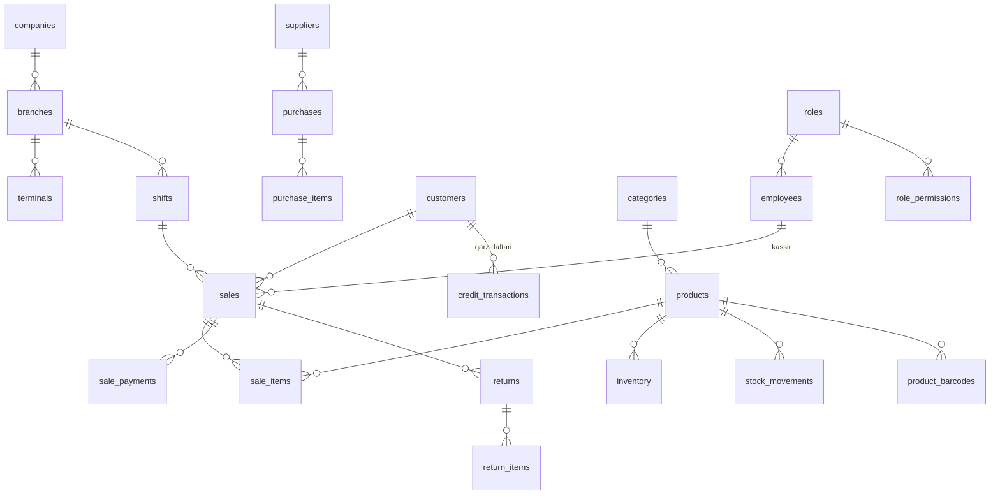

# SavdoOS — Ma'lumotlar bazasi

To'liq DDL: **[`schema.sql`](schema.sql)** (PostgreSQL 16). Bu hujjat — konvensiyalar,
modullar xaritasi, munosabatlar va analitika ombori (OLAP) dizayni.

## Ishga tushirish
```bash
createdb savdoos
psql -d savdoos -f db/schema.sql
```
Kelajakda migratsiyalar **Alembic** orqali (`schema.sql` — boshlang'ich holat).

---

## Oltin qoidalar (analitika uchun kritik)

| Qoida | Nima uchun |
|---|---|
| **Snapshot narx + tannarx** — `sale_items.unit_price` va `unit_cost` sotilgan ondagi qiymatda muzlatiladi | Narx keyin o'zgarsa ham tarixiy **marja/foyda** to'g'ri qoladi. "1 ta data ham muhim" |
| **Soft-delete** — `deleted_at`, fizik `DELETE` yo'q | Hech qanday ma'lumot yo'qolmaydi, audit va analitika buzilmaydi |
| **Ledger = haqiqat** — qoldiq/qarz `*_ledger`/`*_movements` yig'indisidan | `inventory.qty`, `customers.credit_balance`, `suppliers.balance` — bu faqat **cache**; asl manba harakatlar/daftar |
| **Append-only sotuvlar** — `sales` o'zgartirilmaydi, faqat qaytarish qo'shiladi | Offline sync konflikti bo'lmaydi |
| **client_uuid** — offline yozuvlarda idempotentlik kaliti | Kassa qayta push qilsa ham ikki marta yozilmaydi |

## Umumiy ustunlar
Har mutable jadval: `id UUID` · `created_at` · `updated_at` · `created_by` ·
`deleted_at` · `row_version bigint` (sync) · transaksiyalarda `client_uuid`.
`updated_at`+`row_version` avtomatik yangilanadi (`set_row_meta()` trigger).

- **Pul:** `numeric(14,2)` · **Miqdor:** `numeric(14,3)` (kg/litr kasr) · **Vaqt:** `timestamptz`
- **Qidiruv:** `pg_trgm` GIN indeks (mahsulot nomi, mijoz ismi) — tez ILIKE

---

## Modullar (13 domen · ~55 jadval)

1. **Tashkilot** — `companies` → `branches` (filial) → `terminals` (kassa apparati)
2. **Auth/RBAC** — `roles`, `permissions`, `role_permissions`, `employees`, `employee_permissions` (per-xodim override), `employee_branches`, `auth_sessions`
3. **Katalog** — `categories` (ierarxik), `products` (artikul unikal), `product_barcodes` (ko'p barcode), `units`, `brands`, `product_prices` (**narx tarixi**), `product_suppliers`
4. **Ombor** — `inventory` (cache), `stock_movements` (**fakt ledger**), `stock_batches` (partiya/muddat/FEFO), `stock_counts`+items (inventarizatsiya), `stock_transfers`+items (filiallararo)
5. **Xaridlar** — `suppliers`, `purchases`+`purchase_items`, `supplier_payments`, `supplier_ledger`
6. **Mijozlar/Qarz** — `customers`, `customer_groups`, `credit_transactions` (**qarz daftari**), `customer_payments` (qarzni yopish), `loyalty_transactions`
7. **Sozlamalar** — `settings` (scoped JSONB), `payment_methods`, `tax_rates`, `receipt_templates`
8. **Smena/Kassa** — `shifts`, `cash_movements` (inkassa/xarajat)
9. **Sotuvlar** — `sales`, `sale_items` (**snapshot**), `sale_payments` (split), `sale_discounts`
10. **Qaytarishlar** — `returns` (`reason`, `restock`), `return_items`
11. **Import** — `import_jobs`, `import_rows` (1C/Excel/CSV ustasi)
12. **Sync** — `sync_devices`, `sync_log` (idempotentlik), `sync_cursors`
13. **Audit** — `audit_log` (before/after JSONB), `activity_events` (event-stream)

---

## Asosiy munosabatlar



## Butunlik qoidalari (app/trigger darajasida)
- Savdo yakunlanganda: `sale_items` yoziladi → har item uchun `stock_movements(type=sale_out)` → `inventory.qty` kamayadi. Nasiya bo'lsa → `credit_transactions(charge)` + `customers.credit_balance`.
- Qaytarish: `restock=true` bo'lsa `stock_movements(return_in)`, aks holda `writeoff`.
- Kirim (`purchases`): `stock_movements(purchase_in)` + `stock_batches` (muddat bilan) + `product_prices` (kelish narxi yangilansa).
- `inventory.qty` va balanslar davriy ravishda harakatlardan **rekonsilizatsiya** qilinadi (nomuvofiqlikni ushlash uchun).

---

## Analitika ombori (OLAP — DuckDB / ClickHouse)

OLTP (Postgres) tez yozuv uchun; **og'ir analitika alohida ombor**da. ETL (Celery) OLTP
jadvallaridan yulduz-sxema (star schema) yig'adi:

**O'lchov (dimension):** `dim_date`, `dim_product`, `dim_category`, `dim_branch`,
`dim_cashier`, `dim_customer`, `dim_supplier`, `dim_payment_method`

**Fakt (fact):**
| Fakt jadval | Grain (bir qator) | Manba |
|---|---|---|
| `fact_sales` | bitta chek qatori | `sale_items` (+ snapshot narx/tannarx) |
| `fact_inventory` | bitta zaxira harakati | `stock_movements` |
| `fact_purchases` | bitta kirim qatori | `purchase_items` |
| `fact_credit` | bitta qarz tranzaksiyasi | `credit_transactions` |
| `fact_shifts` | bitta smena yopilishi | `shifts` |

### Hisobot/Dashboard → manba
| UI element | Manba (Postgres view / OLAP) |
|---|---|
| Hisobotlar — P&L (sof tushum, foyda, QQS) | `mv_daily_sales` + `fact_sales` |
| Hisobotlar — kategoriya kesimi | `mv_category_performance` |
| Hisobotlar/Dashboard — top mahsulot | `mv_product_profit` |
| Dashboard — savdo/foyda grafigi | `mv_daily_sales` |
| Dashboard — to'lov usullari | `mv_payment_breakdown` |
| Dashboard — muddati yaqin | `v_expiring_soon` |
| Dashboard/Ombor — kam qolgan | `v_low_stock` |
| Dashboard/Mijozlar — qarz bloki | `v_customer_debt` |
| Hisobotlar — alertlar (zararga sotilgan) | `fact_sales` (unit_price < unit_cost) |
| Bashorat (ML, kelajak) | `fact_sales` → Prophet |

`mv_*` materialized view'lar Postgres'da (tez, `REFRESH … CONCURRENTLY`); haqiqiy katta
hajmda `fact_*` DuckDB/ClickHouse'ga ko'chadi.

---

## Lokal kassa (SQLite) farqi
- Bir xil jadval nomlari, lekin: `uuid`→`text`, `numeric`→`REAL/INTEGER`, `jsonb`→`text`, `timestamptz`→`text (ISO)`.
- Faqat kerakli jadvallar (katalog, inventory, sales, returns, shifts, customers, settings) + `outbox` (push navbati).
- `stock_movements`/`sales` lokalda ham append-only → serverga `sync_log` orqali idempotent push.
